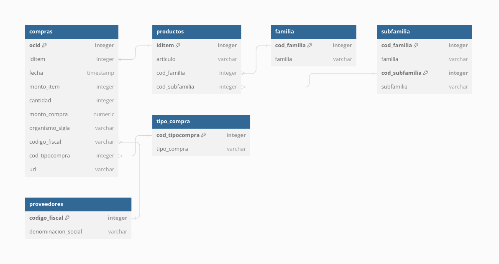

<!-- README.md is generated from README.Rmd. Please edit that file -->

# Monitor Compras Públicas

<!-- badges: start -->
<!-- badges: end -->

La aplicación Shiny **Monitor de Compras Públicas** (*Procurement
Insights*) ofrece una interfaz intuitiva y amigable para explorar y
examinar diferentes aspectos de la contratación pública en Uruguay para
el período 2002-2021. Allí se pueden realizar consultas y filtrar los
datos según diversos criterios, como el tipo de contrato, la entidad
adjudicadora o el proveedor, así como también descargarlos. Además, se
incluyen herramientas gráficas interactivas para representar visualmente
la distribución de los contratos, las tendencias a lo largo del tiempo y
otros análisis descriptivos.

Los gobiernos desempeñan un papel crucial en la regulación del
comportamiento de particulares y empresas con el fin de garantizar el
suministro eficaz de bienes y servicios públicos. La contratación
pública, aunque impulsa la actividad económica, también puede plantear
problemas de riesgo moral en términos de transparencia y equidad en los
procesos de adquisición. Para abordar estos desafíos, los gobiernos
implementan normativas de compra. Es fundamental comprender el impacto
de estas regulaciones. En este contexto, hemos desarrollado esta
aplicación en R.

## Datos brutos

La principal fuente de información utilizada son los datos sobre las
compras y contrataciones de los organismos públicos que se publican en
formato de datos abiertos por la [Agencia Reguladora de Compras
Estatales
(ARCE)](https://www.gub.uy/agencia-reguladora-compras-estatales/datos-y-estadisticas/datos/open-contracting);
disponible en el formato del Estándar de Datos de la [Open Contracting
Partnership](https://www.open-contracting.org/data-standard/).

Este formato es un estándar global que permite visualizar el ciclo de
vida (llamado, adjudicación e implementación) de cada compra o
contratación realizada por un organismo público. El estándar desagrega
la información a nivel de compra. Esta información se actualiza de forma
sistemática, una vez al día.

## Datos procesados

Esta aplicación no es un producto de ARCE. Los datos utilizados en este
proyecto corresponden a las adjudicaciones realizadas por organismos
públicos, entre 2002 y 2021. La descarga de esta información se realiza
utilizando código R y posteriormente se realiza una depuración de los
datos y creación de nuevas variables como monto_item (precio unitario
del item), unidad de presentación del producto, entre otras. Luego todas
las variables que refieren a montos son llevadas a pesos uruguayos
constantes de 2011 para que sean comparables en diferentes momentos del
tiempo. Las principales variables que se incluyen en dicho formato son:

| Variable            | Descripción                                               |
|:--------------------|:----------------------------------------------------------|
| articulo            | nombre del artículo (producto o servicio)                 |
| iditem              | identificación del artículo                               |
| cod_fam             | código de la familia del artículo                         |
| cod_subfam          | código de la sub-familia del artículo                     |
| familia             | descripción de la familia                                 |
| sub_familia         | descripción de la sub-familia                             |
| codigo_fiscal       | RUT del proveedor                                         |
| denominacion_social | denominación social de proveedor                          |
| fecha               | fecha de la compra (adjudicación)                         |
| ocid                | identificador de la compra                                |
| monto_item          | precio unitario del artículo                              |
| cantidad            | cantidad comprada del articulo                            |
| monto_item_total    | monto total comprado del artículo (monto_item x cantidad) |
| monto_compra        | monto total de la compra                                  |
| organismo_sigla     | organismo comprador                                       |
| cod_compra          | código del tipo de compra                                 |
| tipo_compra         | descripción del tipo de compra                            |
| url                 | link a la compra en la web de ARCE                        |

El ocid identifica la compra y permite su trazabilidad en el sitio web
de ARCE. <!-- -  unidad ejecutora e inciso comprador -->
<!-- -  código fiscal del proveedor -->
<!-- -  código del artículo/servicio adquirido (incluyendo su sub-familia y familia) -->
<!-- -  cantidad comprada  --> <!-- -  monto pagado sin impuestos  -->
<!-- -  monto total de la compra -->
<!-- -  moneda en la que se realizó la compra -->
<!-- -  fecha de publicación de la compra -->
<!-- -  tipo de procedimiento de compra -->
<!-- -  presentación del artículo adquirido -->

## Estructura de tablas

Los datos se estructuran en seis tablas de manera de facilitar el acceso
a través de la Shiny. El siguiente esquema muestra las variables que la
integran, su tipo, las variables clave y la interdependencia entre las
tablas.

La tabla de compras contiene millones de registro y se guarda como una
lista de R donde cada elemento corresponde a las compras de un año
específico. Las otras tablas se guardan en formato *csv* y se leen con
la función `fread()` del paquete `data.table`. Desde la APP se pueden
descargar las compras por año o descargar la totalidad de las compras en
un mismo archivo.

## Código

El código está de la Shiny está casi complementamente desarrollado en R
y se estructura de forma modular para una mejor legibilidad y
performance. También se crearon funciones para realizar los gráficos y
tablas que se reutilizan en varias partes de la APP. Los gráficos están
realizados utilizando los paquetes plotly, ggplot2 y echarts4r. El
código complementario en css, js y HTML se encuentra en archivos
separados en pos de mantener la legibilidad del código. El siguiente
diagrama muestra cómo se estructuran los archivos y carpetas.

La APP se estructura en 5 módulos que corresponden a los 5 paneles
detallados a continuación:

- **VISUALIZACIONES** donde se muestra un resumen de las compras en los
  últimos 5 años para algunos organismos específicos a modo de ejemplo;
- **EXPLORAR COMPRAS** donde se pueden filtrar los datos a nivel de
  ORGANISMOS/PROVEEDORES/PRODUCTOS para ciertos años y se grafican el
  monto o cantidad comprada así como también se crea una tabla con los
  datos seleccionados;
- **HISTÓRICO** donde se puede ver a nivel de
  ORGANISMOS/PROVEEDORES/PRODUCTOS la evolución en el tiempo de las
  ventas y de los precios de dichos productos;
- **DATOS** donde se pueden previsualizar los datos y el diccionario de
  variables así como también descargarlos;
- **PREGUNTAS FRECUENTES** donde se listan una serie de preguntas y
  respuestas necesarias para comprenden los datos.

Una de las principales ventajas de usar módulos en una Shiny es no
repetir partes del código varias veces, lo que además de reducir la
cantidad de código, facilita la depuración de errores en el proceso de
*testing* y lo vuelve más legible. De esta manera, se puede desarrollar
y corregir una parte de la APP sin afectar el resto.

Podés acceder a la aplicación aquí:
